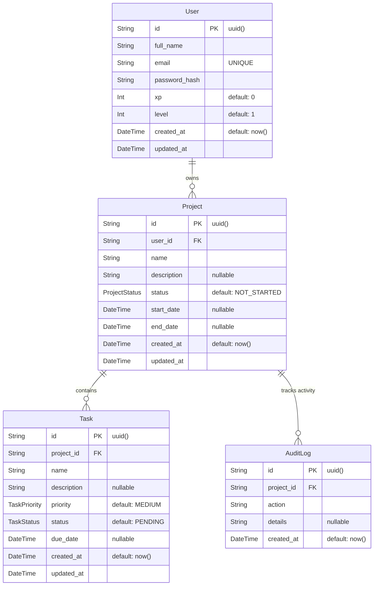

# TaskFlow Entity-Relationship (ER) Diagram

This document contains the Entity-Relationship (ER) diagram for the TaskFlow project, accurately reflecting the database schema defined in `schema.prisma` and generated in the SQL migrations.

## ER Diagram

## Enums

- **ProjectStatus**: `NOT_STARTED`, `IN_PROGRESS`, `COMPLETED`
- **TaskStatus**: `PENDING`, `IN_PROGRESS`, `COMPLETED`
- **TaskPriority**: `LOW`, `MEDIUM`, `HIGH`

## Relationships
- **User -> Project (1:N)**: One User can own many Projects. Deleting a user cascades and deletes all their projects.
- **Project -> Task (1:N)**: One Project contains many Tasks. Deleting a project cascades and deletes all associated tasks.
- **Project -> AuditLog (1:N)**: One Project has many AuditLogs (Activity logs). Deleting a project cascades and deletes all associated logs.
