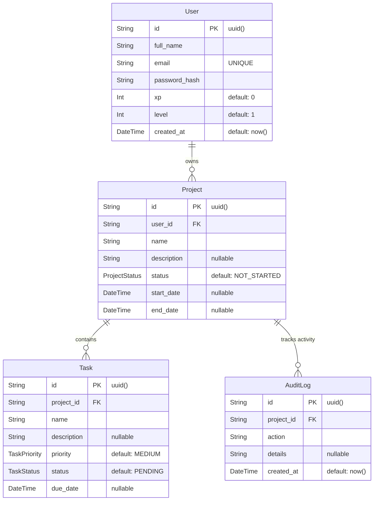

# 🎯 TaskFlow Interview Preparation Guide

This document provides a comprehensive, end-to-end guide to prepare you for your interview based on the **TaskFlow** project we built. It covers everything from basic web development concepts to advanced system design, database architecture, and performance optimization techniques that were used in this specific project.

---

## 🟢 Basic Concepts (The Foundation)

### 1. What is the MERN / PERN stack?
**Question:** "What stack did you use to build this project and why?"
**Answer:** I used a modified PERN stack: **P**ostgreSQL, **E**xpress, **R**eact, and **N**ode.js. I chose PostgreSQL over MongoDB because project management inherently involves highly relational data (Users own Projects, Projects contain Tasks). A relational SQL database ensures data integrity, strict schemas, and cascading deletes, which are crucial for this type of application.

### 2. What is the DOM and how does React's Virtual DOM differ?
**Question:** "What does DOM stand for, and why does React use a Virtual DOM instead?"
**Answer:** **DOM** stands for **Document Object Model**. It is the browser's programming interface for HTML documents, representing the webpage structure as a tree of nodes (like `
` and `<h1>`). Manipulating the real browser DOM directly is notoriously slow and computationally expensive.
React solves this performance bottleneck by using a **Virtual DOM**, which is a lightweight, in-memory JavaScript copy of the real DOM. When a user interacts with the app, React updates this Virtual DOM first. It then compares the new Virtual DOM with the previous version (a process called *Reconciliation* or *Diffing*), calculates the exact minimal changes needed, and strictly updates only those specific nodes in the real browser DOM.

### 3. Understanding React Rendering Lifecycle
**Question:** "What exactly triggers a component to 're-render' in React, and how do you prevent bad performance?"
**Answer:** A React component will automatically re-render when:
1. Its internal state changes (e.g., calling `setLoading(true)`).
2. The props passed down from its parent component change.
3. Its parent component re-renders (this causes a cascade of child re-renders by default).
4. Data from a consumed React Context (like `AuthContext`) changes.

**Follow-up:** "How do you prevent unnecessary re-renders?"
**Answer:** Unnecessary re-renders cause UI lag. To prevent them, you can:
- Wrap child components in `React.memo` so they only re-render if their specific props change.
- Use `useMemo` to cache the results of heavy calculations.
- Use `useCallback` to cache function references (like we did with `loadTasks`), preventing child components from interpreting newly recreated functions as "changed props".

### 4. What is REST?
**Question:** "Explain the RESTful principles used in your backend."
**Answer:** My Express backend follows REST (Representational State Transfer) architecture. It uses standard HTTP methods mapped to CRUD operations:
- `POST /api/tasks` (Create)
- `GET /api/tasks` (Read)
- `PUT /api/tasks/:id` (Update)
- `DELETE /api/tasks/:id` (Delete)
It is stateless, meaning every request from the client contains all the necessary authentication (JWT token via HTTP-only cookies) needed for the server to process it.

---

## 🟡 Intermediate Concepts (Architecture & Logic)

### 5. JWT Authentication & Security
**Question:** "How did you implement user authentication securely?"
**Answer:** I used JSON Web Tokens (JWT). When a user logs in, the backend generates a signed JWT containing their User ID. Crucially, instead of sending it back in the JSON body to be stored in `localStorage` (which is vulnerable to XSS attacks), I send it back inside an **HTTP-only, secure cookie**. This prevents JavaScript from accessing the token, drastically improving security.

### 6. Express Middleware & Request Handling
**Question:** "What is Middleware in Express, and how did you use it?"
**Answer:** Middleware functions are scripts that have access to the Request and Response objects before they reach the final route handler. In this project, I used built-in middleware like `express.json()` to parse incoming JSON bodies, `cookie-parser` to securely read JWT cookies, and custom middleware like `verifyToken`. The `verifyToken` middleware intercepts every protected route request, decodes the JWT, and attaches the `userId` to `req.user` so the controllers know exactly who is making the request.

### 7. Backend Error Handling Strategy
**Question:** "How do you handle errors in your Node.js backend so the server doesn't crash?"
**Answer:** Every single asynchronous controller function is wrapped in a `try/catch` block. If a database operation fails or Prisma throws an error, the `catch` block intercepts it and responds with a standard `res.status(500).json({ error: "Something went wrong" })`. This ensures the Node process never crashes from unhandled promise rejections, and the frontend always receives a readable error message instead of an infinite loading screen.

### 8. Optimistic UI Updates
**Question:** "How did you ensure the application feels fast and responsive?"
**Answer:** I implemented **Optimistic UI Updates**. When a user completes a task, instead of waiting for the server to respond before updating the UI, the frontend immediately updates the React state to show the task as "Completed". It sends the API request in the background. If the request fails, it instantly reverts the UI and shows an error toast. This makes the app feel instantaneous, with zero network latency.

### 9. Relational Database Design & Prisma
**Question:** "Explain your database schema and why you chose Prisma."
**Answer:** I used **Prisma ORM** for type-safe database access. My schema has three core models: `User`, `Project`, and `Task`.
- A 1-to-Many relationship exists between User and Project.
- A 1-to-Many relationship exists between Project and Task.
- I used `onDelete: Cascade` on the foreign keys. This means if a user deletes a Project, the database automatically cleans up and deletes all Tasks associated with that project without me having to write extra backend logic.

**Visual ER Diagram:**

---

## 🔴 Advanced Concepts (Performance & System Design)

### 10. Node.js Event Loop & Concurrency
**Question:** "Node.js is single-threaded. How does it handle hundreds of concurrent users without freezing?"
**Answer:** Node.js uses an asynchronous, non-blocking I/O model powered by the **Event Loop** and `libuv`. When my backend receives a request to query the PostgreSQL database (which takes time), Node doesn't halt its single thread. Instead, it offloads the database operation to the OS/database, frees up the main thread to instantly accept the next user's HTTP request, and executes the callback (via Promises/async-await) only when the database returns the data. This makes Node incredibly efficient for I/O-heavy applications like this one.

### 11. Gamification & Transactions
**Question:** "Explain the gamification logic. How do you ensure XP is calculated accurately?"
**Answer:** I implemented a unified XP and Leveling system. When `PATCH /api/tasks/:id/complete` is called, the backend calculates the user's new XP (Current XP + 50). It then calculates the new level using a mathematical formula: `Math.floor(newXp / 100) + 1`. This logic happens entirely on the backend to prevent users from manipulating their XP via the frontend. 

### 12. Throttling and Race Conditions
**Question:** "What happens if a user spams the 'Complete Task' button very fast?"
**Answer:** If not handled, this causes a **Race Condition** where multiple `complete` and `uncomplete` requests are fired out of order, confusing the database and the UI. I solved this by adding an `isToggling` state lock on the React component. When the button is clicked, it immediately disables the button and ignores further clicks until the asynchronous `await onToggleComplete()` function fully resolves.

### 13. Caching Strategy
**Question:** "How are you minimizing database queries and improving load times?"
**Answer:** I implemented a two-tier caching strategy. On the frontend, I use `localStorage` to cache API responses (e.g., `taskflow_project_XYZ`). When a user navigates to a project, the app instantly parses and displays the cache, while silently sending a background `fetch` to the server to check for new updates. Once the server responds, it replaces the cache and updates the UI. This provides a "Zero-Loading Screen" experience. When mutations occur (like creating a task), I manually invalidate (`removeItem`) the specific cache keys so the next load fetches fresh data.

### 14. React Hooks & Re-renders
**Question:** "Why did you use `useCallback` for your data fetching functions?"
**Answer:** Functions like `loadTasks` are defined inside the React component and are passed as dependencies to `useEffect`. If I didn't wrap them in `useCallback`, React would recreate the function entirely on every single render. This would cause the `useEffect` to trigger an infinite loop of network requests. `useCallback` memoizes the function, ensuring its reference stays exactly the same across renders unless its specific dependencies (`id`, `taskFilter`) change.

### 15. Frontend API Calling Architecture
**Question:** "How did you structure API calls in the React frontend to ensure secure and real-time data?"
**Answer:** I created a centralized API client using **Axios**. Instead of scattering `fetch` calls across all my React components, I defined clean, reusable service functions in the `/src/api` folder. 
More importantly, I utilized **Axios Interceptors**:
- **Request Interceptor**: Silently attaches the JWT Bearer token to every single outgoing request so the user doesn't have to repeatedly log in. It also appends a dynamic cache-busting timestamp (`?_t=Date.now()`) to all `GET` requests to physically bypass the browser's aggressive disk caching, guaranteeing the dashboard updates in 100% real-time.
- **Response Interceptor**: Listens for `401 Unauthorized` responses from the backend. If the JWT token expires, the interceptor automatically catches the error globally, clears the local storage, and forcefully redirects the user to the Login page to prevent the UI from freezing in a broken state.

---

## ☁️ Deployment & DevOps

### 16. Deploying the Application (Render.com)
**Question:** "How would you deploy this application to production?"
**Answer:** I architected the app to be easily deployed on modern PaaS (Platform as a Service) providers like **Render.com**. 
1. **Frontend (React/Vite)**: Render natively supports static site hosting. By simply linking the GitHub repository and telling Render to execute `npm run build` in the `/frontend` directory, it will automatically serve the highly optimized `dist` folder via a global CDN.
2. **Backend (Node.js/Express)**: I would deploy the backend as a "Web Service" on Render. I provided a production-ready `Dockerfile` that uses `node:20-alpine` for maximum performance, automatically installs OpenSSL for Prisma, runs `npx prisma migrate deploy` on startup to keep the cloud database schemas in sync, and then starts the Express server.
3. **Database**: Render offers managed PostgreSQL instances. By simply injecting the provided `DATABASE_URL` into the backend service's Environment Variables, the Node app connects instantly.

---

## 📁 Project File Structure & Architecture

### 17. How is the codebase organized?
**Question:** "Walk me through your project's directory structure."
**Answer:** I used a standard, highly scalable monolithic repository with split `frontend` and `backend` directories to keep the separation of concerns clear.

**Backend Structure:**
- `/src/controllers`: Contains the core business logic (e.g., `task.controller.js` handling XP and task creation).
- `/src/routes`: Maps HTTP endpoints to specific controllers.
- `/src/middleware`: Handles request interception (e.g., verifying JWT tokens, input validation).
- `/prisma/schema.prisma`: The single source of truth for the database schema.

**Frontend Structure:**
- `/src/components`: Reusable UI elements (`Navbar`, `TaskRow`, `ProjectCard`).
- `/src/pages`: Top-level views mapped to routes (`Dashboard`, `ProjectDetail`).
- `/src/api`: Axios client wrappers to cleanly fetch data without cluttering UI components.
- `/src/context`: React Context providers (like `AuthContext`) for global state management.

---

## 💻 Programming Languages & Coding Style

### 18. Languages Used
**Question:** "What programming languages does this app run on?"
**Answer:**
1. **JavaScript (ES6+)**: The primary language powering both the Node.js backend and React frontend. I heavily utilized modern ES6 features like Object Destructuring, Spread Syntax, Arrow Functions, and Optional Chaining (`?.`).
2. **JSX (JavaScript XML)**: Used in React to write HTML structures directly inside JavaScript files.
3. **SQL**: Used via Prisma to query the PostgreSQL database.
4. **CSS**: Powered entirely by **TailwindCSS**, a utility-first CSS framework.

### 19. Coding Style & Design Patterns
**Question:** "What coding standards and patterns did you follow?"
**Answer:**
- **Component-Based Architecture**: Everything in the frontend is broken down into independent, modular React components to ensure high reusability and maintainability.
- **Utility-First Styling**: I used Tailwind CSS directly inside className attributes. This eliminates the need for separate `.css` files, avoids class naming collisions, and enforces a strict design system (colors, spacing).
- **Asynchronous Programming**: I used modern `async/await` syntax wrapped in `try/catch` blocks across both the frontend and backend, avoiding nested `.then()` promise chains (Callback Hell).
- **Controller-Service Pattern**: In the backend, routes are kept extremely thin, immediately delegating requests to designated Controller functions to process business logic cleanly.

### 20. Node.js vs Vue.js (The Trick Question)
**Question:** "Can you compare Node.js and Vue.js? When would you use one over the other?"
**Answer:** This is a classic trick question! They serve completely different purposes and do not compete with each other. 
- **Node.js** is a **backend runtime environment**. It allows you to run JavaScript on a server to build APIs, communicate with databases (like PostgreSQL), and handle heavy business logic.
- **Vue.js** (just like React) is a **frontend framework**. It runs entirely inside the user's web browser and is strictly used to build the visual User Interface (buttons, forms, pages).
In a full-stack application, you wouldn't choose *between* them; you would use them *together* (e.g., building a Vue.js frontend that fetches data from a Node.js backend).

---

## 💡 Top Tips for the Interview
1. **Be confident about the stack:** Emphasize that you chose PostgreSQL for data integrity and Express/React for speed of development.
2. **Talk about UX:** Interviewers love when developers care about the user. Mention the "Optimistic UI" and "Debouncing/Locking" you added to make the app feel snappy.
3. **Bring up Security proactively:** Don't wait for them to ask about security. Mention that you specifically chose HTTP-only cookies over localStorage for JWTs to prevent Cross-Site Scripting (XSS).
