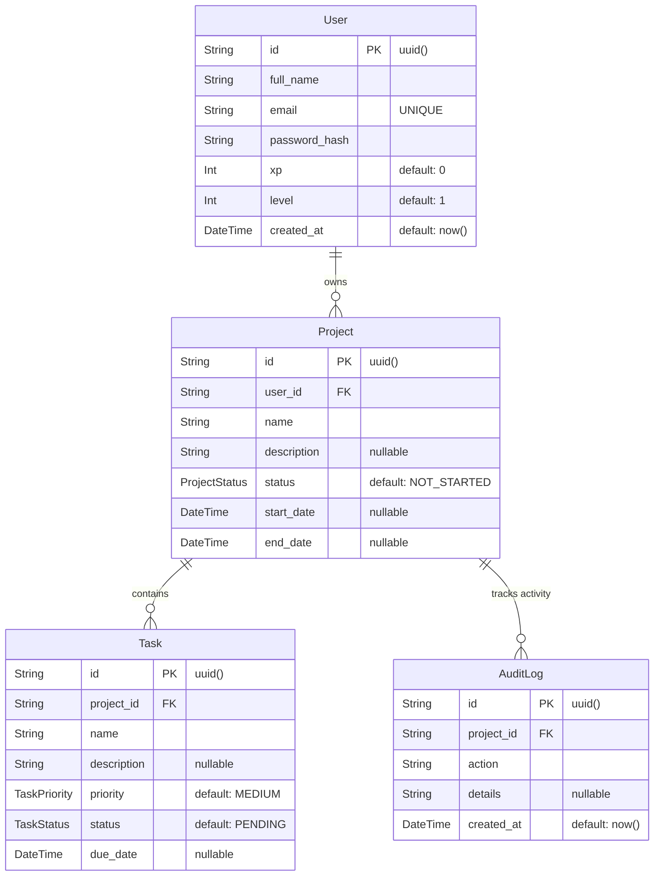

# 🚀 TaskFlow — Gamified Project Management


TaskFlow is a next-generation Project Management System built on the **PERN Stack**. It goes beyond standard task management by introducing **Gamification**, rewarding users with XP and visual "Level Ups" as they complete their daily tasks.

---

## ✨ Core Features
- **Full Authentication**: Secure JWT-based auth via HTTP-only cookies.
- **Dynamic Dashboard**: GitHub-style Activity Heatmap to track your daily progress.
- **Gamification Engine**: Earn XP, level up, and watch your "Tree of Focus" graphically grow and evolve as you complete tasks.
- **Project & Task CRUD**: Full management, search, and filtering capabilities.
- **Audit Logging**: Every action you take is tracked and displayed in a real-time Activity Log.

---

## 🗄️ Database Architecture (ER Diagram)
The database is built on PostgreSQL and managed via Prisma ORM with strict referential integrity.



### Original Database Schema (Tables)

#### `User`
| Column | Type | Constraints / Defaults | Description |
|---|---|---|---|
| `id` | String | **PK**, `uuid()` | Unique user identifier |
| `full_name` | String | | User's display name |
| `email` | String | **UNIQUE** | User's email address |
| `password_hash` | String | | Bcrypt hashed password |
| `xp` | Int | `default: 0` | Gamification experience points |
| `level` | Int | `default: 1` | Gamification user level |
| `created_at` | DateTime | `default: now()` | Account creation timestamp |

#### `Project`
| Column | Type | Constraints / Defaults | Description |
|---|---|---|---|
| `id` | String | **PK**, `uuid()` | Unique project identifier |
| `user_id` | String | **FK** | References `User.id` *(Cascade Delete)* |
| `name` | String | | Project title |
| `description` | String | *Nullable* | Detailed project info |
| `status` | ProjectStatus | `default: NOT_STARTED`| `NOT_STARTED`, `IN_PROGRESS`, `COMPLETED` |
| `start_date` | DateTime | *Nullable* | Project start date |
| `end_date` | DateTime | *Nullable* | Project deadline |
| `created_at` | DateTime | `default: now()` | Timestamp |

#### `Task`
| Column | Type | Constraints / Defaults | Description |
|---|---|---|---|
| `id` | String | **PK**, `uuid()` | Unique task identifier |
| `project_id` | String | **FK** | References `Project.id` *(Cascade Delete)* |
| `name` | String | | Task title |
| `description` | String | *Nullable* | Task details |
| `priority` | TaskPriority | `default: MEDIUM` | `LOW`, `MEDIUM`, `HIGH` |
| `status` | TaskStatus | `default: PENDING` | `PENDING`, `IN_PROGRESS`, `COMPLETED` |
| `due_date` | DateTime | *Nullable* | Task deadline |
| `created_at` | DateTime | `default: now()` | Timestamp |

#### `AuditLog`
| Column | Type | Constraints / Defaults | Description |
|---|---|---|---|
| `id` | String | **PK**, `uuid()` | Unique log identifier |
| `project_id` | String | **FK** | References `Project.id` *(Cascade Delete)* |
| `action` | String | | Type of action taken (e.g. TASK_COMPLETED) |
| `details` | String | *Nullable* | Descriptive log text |
| `created_at` | DateTime | `default: now()` | When the action occurred |

---

## 🛠️ Project Structure
This repository is a scalable monorepo separating the frontend and backend.
```text
├── backend/
│   ├── src/controllers/   # Business logic (XP calculation, DB queries)
│   ├── src/routes/        # Express API endpoints
│   ├── prisma/            # schema.prisma & SQL migrations
│   └── Dockerfile         # Production-ready backend image
├── frontend/
│   ├── src/components/    # Reusable Tailwind UI (TaskRow, VirtualTree)
│   ├── src/pages/         # React Views (Dashboard, ProjectDetail)
│   ├── src/api/           # Axios interceptors & endpoints
│   └── src/context/       # Global Auth state
└── docker-compose.yml     # Local orchestration
```

---

## 🚀 Quick Start Guide

### Option A — Run with Docker (Recommended)
Launch the entire stack (Database, Backend, Frontend) with a single command:
```bash
docker compose up --build
```
- **Frontend UI**: `http://localhost:3000`
- **Backend API**: `http://localhost:5000`
- **Database**: `localhost:5432` *(The backend automatically runs Prisma migrations on startup!)*

### Option B — Run Locally (Without Docker)
Make sure you have Node.js and PostgreSQL installed.
```bash
# 1. Start Backend
cd backend
cp .env.example .env      # Fill in your DATABASE_URL
npm install
npx prisma migrate dev    # Generate tables
npm run dev               # Starts on port 5000

# 2. Start Frontend (In a new terminal)
cd frontend
cp .env.example .env      # VITE_API_URL=http://localhost:5000/api
npm install
npm run dev               # Starts on port 3000
```

### Option C — Run with Supabase
You can swap out local PostgreSQL for a managed **Supabase** database with zero code changes!
1. Go to Supabase > Project Settings > Database > Connection String.
2. Paste it into `backend/.env` under `DATABASE_URL`.
3. Run `npx prisma migrate deploy` to instantly build your tables in the cloud.
